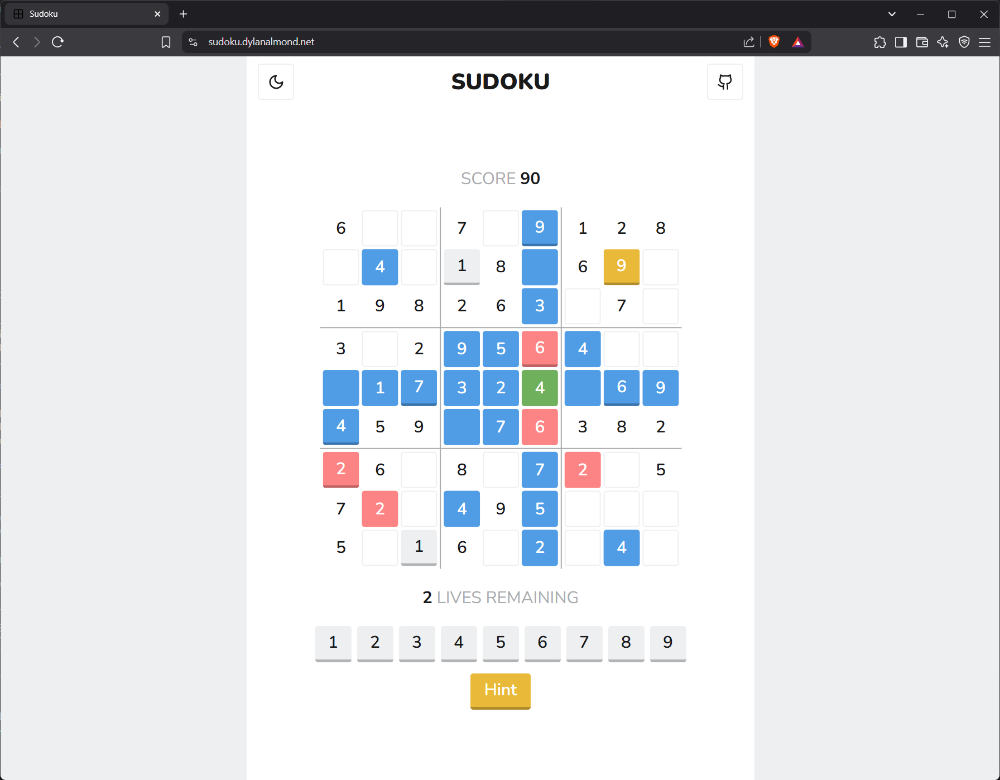

# Sudoku Game

[](LICENSE)

A simple Sudoku game.



## Table of Contents

- [Sudoku Game](#sudoku-game)
  - [Table of Contents](#table-of-contents)
  - [Features](#features)
  - [Prerequisites](#prerequisites)
  - [Installation](#installation)
  - [License](#license)

## Features

- Randomly generated boards
- Drag and Drop values onto and around the board
- Scoring and lives
- Hints fill in a random cell on the board at the cost of a life
- Light and Dark modes
- View the solved board post-game

## Prerequisites

Make sure the following are installed before running the app:

- **Node.js** (v16 or higher)

## Installation

1. **Clone the Repository**

   ```bash
   git clone https://github.com/DylanAlmond/sudoku.git
   cd sudoku
   ```

2. **Install Dependencies**

   ```bash
   yarn install
   ```

3. **Start the Development Server**

   ```bash
   yarn dev
   ```

## License

This project is licensed under the [GPLv3 License](LICENSE).

